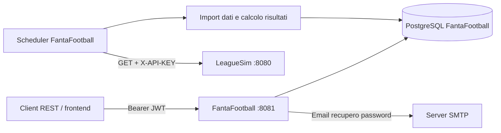

# FantaFootball — contesto completo del progetto

Documento principale aggiornato il **12 settembre 2026**, verificando il codice e i file presenti nel workspace. Serve per comprendere il backend, integrarlo con un frontend e riprendere il lavoro in una nuova sessione senza ricostruire le decisioni già prese.

Le descrizioni riguardano lo stato dei sorgenti locali, incluse le configurazioni locali presenti alla data della verifica. Non certificano un deploy, l'esito dei test o lo stato di un database in esecuzione. Questa revisione è esclusivamente documentale.

## 1. Scopo e confini

FantaFootball è un backend REST per gestire leghe di fantacalcio. Gli utenti si registrano, creano una lega con una propria squadra, invitano altri utenti, compongono le rose tramite acquisti registrati dall'admin, propongono scambi, schierano formazioni e consultano calendario, voti e classifica.

I dati calcistici provengono da **LeagueSim**, un servizio esterno che simula un campionato. FantaFootball importa giocatori, giornate e statistiche, poi applica le proprie regole fantacalcistiche. Le squadre reali di LeagueSim e le fantasquadre degli utenti sono concetti distinti.

Questo repository contiene il backend, i test e gli script SQL. Non contiene l'applicazione frontend né il sorgente di LeagueSim. L'origine browser predefinita `http://localhost:4200` è una configurazione CORS, non la prova che il frontend sia incluso o che usi uno specifico framework.

**Decisione consolidata:** FantaFootball è un consumatore passivo di LeagueSim. Il polling legge lo stato esterno; non avvia la simulazione. Non esiste e non è previsto nel disegno documentato un endpoint FantaFootball per lanciare la simulazione su LeagueSim.

## 2. Documenti recuperati e criterio di aggiornamento

| Documento preesistente | Contenuto recuperato e ruolo attuale |
|---|---|
| [CLAUDE.md](CLAUDE.md) | Convenzioni per agenti, architettura, autorizzazioni, transazioni, configurazione e decisioni sull'integrazione. Rimane una guida operativa breve. |
| [PROJECT_CONTEXT.md](PROJECT_CONTEXT.md) | Contesto storico del servizio esterno LeagueSim. Il nome non indicava un contesto generale di FantaFootball. Rimane una fonte storica esplicitamente distinta dal codice locale verificato. |
| [FRONTEND_API_CONTEXT.md](FRONTEND_API_CONTEXT.md) | Contratti API, flussi utente e note di integrazione frontend. Ora rimanda alle sezioni aggiornate di questo documento. |
| [docs/paginazione-giocatori.md](docs/paginazione-giocatori.md) | Spiegazione della paginazione e del flusso controller → repository → risposta. Rimane un approfondimento aggiornato. |

Questo file consolida le informazioni utili evitando di ripetere come attuali le vecchie ipotesi. In caso di divergenza futura, verificare controller, service, DTO, query e schema: anche i commenti nei sorgenti possono descrivere una fase precedente.

Correzioni principali rispetto ai vecchi contesti:

- Le formazioni hanno già lettura, creazione e aggiornamento.
- Il calendario ha già un `GET`, con punteggi, gol e stato della giornata.
- Catalogo e giocatori disponibili sono paginati e ordinati per ruolo, cognome, nome e ID.
- Esistono ricerca testuale, filtri multipli sul catalogo, squadre reali e intervallo prezzi.
- Esistono dettaglio lega, scambi di lega, elenco moduli e voti della rosa per partita.
- La lettura della rosa non richiede ownership oltre all'autenticazione e include possessi storici.
- Lo svincolo e gli scambi utilizzano ID `TeamPlayer`, benché alcuni parametri si chiamino `playerId`.
- Risultati delle partite e punti di classifica vengono salvati automaticamente durante il polling.
- La scelta di non avviare LeagueSim da FantaFootball è già definita.

## 3. Stack e struttura

Versioni dichiarate nei file locali, non indicazioni sulle ultime versioni disponibili:

| Componente | Configurazione |
|---|---|
| Java | 26 |
| Spring Boot | 4.1.0 |
| Build | Maven; wrapper 3.3.4 che scarica Maven 3.9.16 |
| HTTP | Spring MVC e Spring RestClient sincrono |
| Persistenza | Spring Data JPA, Hibernate, PostgreSQL, HikariCP |
| Sicurezza | Spring Security, OAuth2 resource server per JWT, BCrypt |
| Validazione | Jakarta Validation e `@StrongPassword` |
| Email | Spring Mail / `JavaMailSender` |
| OpenAPI | springdoc-openapi-starter-webmvc-ui 3.0.3 |
| Test | JUnit, Mockito, Spring test/MockMvc, H2 in modalità PostgreSQL |
| Artefatto | `org.generation.italy:FantaFootball:0.0.1-SNAPSHOT` |

Il package base è `org.generation.italy.fantafootball` sotto `src/main/java`.

| Percorso | Responsabilità |
|---|---|
| `controllers/` | Mapping REST, input, validazione DTO, estrazione utente JWT, delega ai servizi. |
| `services/` | Account, leghe, inviti, squadre, mercato, formazioni, catalogo e regole di accesso. |
| `model/entities/` | Entità JPA ed enum di dominio. |
| `model/dto/` | Record di richiesta e risposta, conversioni `fromEntity`/`from`/`of`. |
| `model/repositories/` | Repository JPA, query, aggregati e lock. |
| `model/specifications/` | Filtri e ordinamento del catalogo. |
| `model/exceptions/`, `model/validation/` | Eccezioni di business e validazione password. |
| `security/`, `security/config/` | Emissione/lettura JWT, filtro account, CORS, OpenAPI e bootstrap HEAD. |
| `integration/leaguesim/` | DTO esterni, client HTTP, scheduler, sincronizzazione e import risultati. |
| `calculateMatchday/` | Fantavoti, sostituzioni, modificatore difesa, gol e classifica. |
| `algorithms/` | Algoritmo round-robin indipendente dalla persistenza. |
| `src/main/resources/application.properties` | Configurazione runtime e collegamenti alle variabili d'ambiente. |
| `src/test/` | Test e profilo H2. |
| `database/` | Schema manuale, migrazione password reset e dati per scenari di prova. |

Il flusso ordinario è controller → service → repository → database. Le autorizzazioni sono manuali, prevalentemente nei service; non si usano annotazioni `@PreAuthorize`. Esistono eccezioni da conoscere: `LeagueMatchController` verifica l'admin prima di generare il calendario; `LeagueController.createLeague` apre la transazione che comprende creazione della lega e della prima squadra.



## 4. Modello di dominio e identificativi

| Entità / tabella | Significato e relazioni |
|---|---|
| `AppUser` / `app_users` | Username, email, hash password, abilitazione e `tokenVersion`. Ruoli in `app_user_roles`. |
| `PasswordResetToken` / `password_reset_token` | UUID, utente, hash SHA-256 del token, creazione/scadenza/utilizzo. |
| `League` / `league` | Nome, admin, codice invito, data di creazione, budget iniziale. |
| `LeagueInvite` / `league_invite` | Invito nominale: lega, mittente, destinatario, stato e date. |
| `Team` / `team` | Fantasquadra di un utente in una lega, budget corrente e punti in classifica. |
| `Player` / `player` | Giocatore reale importato: ID esterno, nome, cognome, squadra reale, maglia, ruolo, prezzo e infortunio. |
| `TeamPlayer` / `team_player` | Possesso di un giocatore da parte di una fantasquadra in una lega, con prezzo e date di acquisto/trasferimento. |
| `Trade` / `trade` | Proposta tra due squadre, possesso richiesto e offerto, conguaglio, stato e data. |
| `Matchday` / `matchday` | Giornata reale condivisa tra leghe, identificata esternamente dal numero, con data e stato locale `closed`. |
| `LeagueMatch` / `league_match` | Partita di fantacalcio tra due squadre: lega, round, data, giornata reale e risultato. |
| `LineupType` / `lineup_type` | Numeri di difensori, centrocampisti e attaccanti del modulo; portiere implicito. |
| `Lineup` / `lineup` | Formazione di una squadra per una partita, con modulo e flag difensivo. |
| `LineupPlayer` / `lineup_player` | Collegamento tra formazione e `TeamPlayer`, con flag titolare; chiave composta. |
| `PlayerResult` / `player_results` | Voto e statistiche di un `Player` per una `Matchday`, indipendenti dalle formazioni. |

Identificativi da non confondere:

| Nome | Utilizzo |
|---|---|
| `Player.id` | ID locale del catalogo; usato nell'acquisto da asta e nel fantavoto individuale. |
| `Player.externalId` | ID del giocatore su LeagueSim, usato per import e associazione statistiche. |
| `TeamPlayer.id` | ID del possesso: `TeamPlayerResponse.id`, `LineupPlayerRequest.teamPlayerId`, `requestedPlayerId`/`offeredPlayerId` negli scambi e `{playerId}` nello svincolo. |
| `Matchday.id` | ID locale della giornata reale; usato dall'endpoint del fantavoto individuale. |
| `Matchday.number` | Numero della giornata usato dal client verso LeagueSim. |
| `LeagueMatch.id` | ID della partita di lega; usato per gestire formazioni e voti della rosa. |
| `LeagueMatch.roundNumber` | Progressivo della lega da 1; può differire dal numero della giornata reale. |

Un possesso è attivo quando `transferDate == null`. Lo stesso `Player` può appartenere a squadre in leghe diverse, ma può avere un solo possesso attivo per lega. Gli scambi chiudono i vecchi possessi e ne creano di nuovi, conservando quelli storici per formazioni e proposte precedenti.

## 5. Autenticazione, account e autorizzazioni

### JWT e password

Il login riceve username e password e restituisce `{token, roles}`. Le richieste protette usano `Authorization: Bearer <token>`; non ci sono sessioni applicative o cookie di login. Il token HS256 contiene `iss`, `iat`, `exp`, `sub` (username), `uid`, `tokenVersion` e `roles`. Il frontend può leggere `uid` per riferirsi all'utente, mentre la verifica dell'autenticità resta compito del backend.

`EnabledAccountFilter`, dopo il filtro Bearer, rilegge l'utente dal DB e controlla esistenza, `enabled`, versione token e corrispondenza tra username e `sub`. Un account disabilitato o una versione non più valida produce 401. Non assumere un controllo personalizzato dell'issuer: il decoder configura la chiave HS256, senza aggiungere esplicitamente un validatore per `JWT_ISSUER`.

Cambio username, cambio password e reset password incrementano `tokenVersion`: i token precedenti diventano inutilizzabili. Il cambio username/password risponde 204 senza un nuovo token, quindi occorre autenticarsi di nuovo. La disabilitazione imposta `enabled=false` e conserva i dati. Il logout è un 204 senza revoca: il client elimina il proprio token.

Le password ordinarie sono codificate con BCrypt. `@StrongPassword` richiede almeno 12 caratteri, una minuscola, una maiuscola, una cifra e un carattere non alfanumerico; `@NotBlank` gestisce il valore mancante. Registrazione: username massimo 80 caratteri, email valida massimo 254, unicità senza distinzione maiuscole/minuscole; email salvata normalizzata. Il login ricerca lo username come ricevuto: non estendere automaticamente a esso le regole di confronto della registrazione.

### Recupero password

1. `forgot-password` riceve l'email. Per un utente esistente e abilitato elimina i reset precedenti, genera 32 byte casuali e invia un link con token Base64 URL-safe.
2. Il DB conserva il solo hash SHA-256. La durata predefinita è 30 minuti.
3. La risposta ordinaria è 204 anche per email non riconosciuta o account disabilitato. Un errore SMTP viene loggato senza modificare questo comportamento: 204 non garantisce la consegna.
4. `reset-password` richiede token valido, non scaduto, non usato e utente abilitato; aggiorna password/versione ed elimina i token di reset dell'utente.

### Ruoli e accessi effettivi

`ADMIN` e `USER` sono ruoli globali emessi nel JWT; non concedono automaticamente i permessi di una lega. L'admin contestuale è `League.admin`. HEAD è un account globale opzionale creato allo startup, non un superutente che bypassa i controlli di lega.

| Operazione | Accesso applicato |
|---|---|
| Creazione lega | Utente autenticato; diventa admin e ottiene la prima squadra. |
| Dettaglio lega, elenco squadre/classifica, calendario, scambi di lega | Utente che possiede una squadra nella lega. |
| Disponibili di lega | Admin oppure membro con squadra nella lega. |
| Invio inviti, generazione calendario, registrazione acquisti | Admin della lega. |
| Creazione squadra | Admin oppure utente il cui ultimo invito nella lega è `ACCEPTED`. |
| Rinomina squadra, creazione/aggiornamento formazione | Proprietario della squadra. |
| Lettura formazione e voti della rosa per partita | Proprietario oppure admin della lega. |
| Lettura rosa `GET /api/teams/{teamId}/players` | Qualunque utente autenticato; nessun controllo di appartenenza nel service. |
| Svincolo | Proprietario oppure admin; rifiuto di autorizzazione restituito come 409. |
| Scambi della propria squadra | Proprietario; per accettare una proposta serve essere il ricevente, per rifiutarla basta essere uno dei due partecipanti. |
| Catalogo, metadati catalogo, moduli, fantavoto individuale, punteggio lineup | Autenticazione; nessun ulteriore controllo di ownership in questi endpoint. |

Le rotte pubbliche implementate sono solo i quattro POST auth `login`, `register`, `forgot-password`, `reset-password`, oltre alla documentazione Swagger. `logout` è protetto. `/api/public/**` e `POST /api/registration-requests` sono consentiti nella configurazione ma non hanno controller: non rappresentano funzionalità disponibili.

## 6. Flussi di utilizzo e regole di business

### Lega, inviti e squadre

`POST /api/leagues` crea in una transazione la lega e la squadra dell'admin. Il budget della lega viene copiato sulle nuove squadre, mentre `Team.budget` rappresenta il credito residuo. Un utente ha al massimo una squadra per lega; i nomi squadra sono univoci all'interno della stessa lega.

L'admin invita un utente per username. Non sono consentiti auto-inviti, inviti pending duplicati o inviti a chi possiede già una squadra nella lega. Il destinatario accetta o rifiuta; il mittente può annullare solo un invito pending, eliminandolo fisicamente. L'accettazione **non crea la squadra**: segue `POST /api/teams`. I dettagli di lega che richiedono membership diventano accessibili dopo la creazione della squadra.

Stati invito: `PENDING`, `ACCEPTED`, `DECLINED`, `EXPIRED`, `CANCELLED`. `CANCELLED` è un comando che elimina la riga; non viene salvato come stato. Non risulta un processo automatico per assegnare `EXPIRED`. Il codice invito generato sulla lega è esposto nel DTO ma non esiste un flusso di ingresso tramite codice.

### Catalogo e disponibilità

Il catalogo comprende i giocatori importati. Il prezzo del catalogo e il prezzo di acquisto sono valori distinti. La disponibilità è specifica della lega: la query esclude i giocatori con un `TeamPlayer` attivo nella lega richiesta, senza escludere i possessi in altre leghe.

Catalogo e disponibili restituiscono sempre una `PageResponse`, anche quando i parametri di paginazione sono omessi. Default `page=0`, `size=20`; dimensione ammessa 1–100. Pagina negativa o offset `page * size > Integer.MAX_VALUE` producono 400. Una pagina oltre l'ultima restituisce contenuto vuoto e conteggi reali.

L'ordinamento viene applicato nel database prima della paginazione: **P → D → C → A, cognome, nome, ID crescente**. Non è un ordinamento per solo ID. L'ordine alfabetico segue anche la collation del DB.

`GET /api/players` supporta `role` e `realTeamName` come liste, `minPrice`, `maxPrice`, `injured`, `search`, `page`, `size`. Esempio: `/api/players?role=P&role=D&realTeamName=Roma&search=rossi&page=0&size=20`. I ruoli sono `P`, `D`, `C`, `A`; le squadre reali vengono confrontate senza distinzione maiuscole/minuscole dopo trim. Prezzi non negativi, minimo non superiore al massimo.

`search` cerca sottostringhe nel nome, cognome o nome completo, senza distinzione maiuscole/minuscole. `%`, `_` e `!` sono trattati letteralmente tramite escape, non come wildcard fornite dall'utente. I disponibili di lega supportano `page`, `size` e `search`, non l'intero insieme dei filtri del catalogo.

`GET /api/players/real-teams` restituisce i nomi distinti e ordinati delle squadre reali, escludendo nomi nulli/vuoti. `GET /api/players/price-range` restituisce minimo/massimo considerando ruolo, squadra, infortunio e ricerca, **ignorando i filtri di prezzo**: serve a definire gli estremi del filtro. Se non ci sono corrispondenze i due estremi possono essere null.

### Acquisti, rose e scambi

L'acquisto da asta è una singola assegnazione registrata dall'admin: riceve `Player.id` e `purchasePrice >= 0`, verifica lega della squadra, disponibilità e budget, crea `TeamPlayer` e sottrae il prezzo. Non è un'asta con offerte in tempo reale né un acquisto self-service del proprietario.

La lettura rosa restituisce tutte le righe `TeamPlayer` della squadra, comprese quelle trasferite. Per scegliere i giocatori schierabili usare solo `transferDate == null` e conservare `id` come `teamPlayerId`. Il campo del ruolo in questa risposta si chiama `playerRole`, mentre nel catalogo e nelle formazioni si chiama `role`.

Lo svincolo elimina fisicamente il `TeamPlayer`, non valorizza `transferDate` e non rimborsa il budget. Il parametro `{playerId}` del DELETE è in realtà `TeamPlayer.id`. Una violazione di integrità viene tradotta in `PLAYER_IN_USE`; le FK possono includere riferimenti da formazioni e scambi.

Una proposta di scambio usa due possessi attivi, offerto e richiesto, appartenenti alle squadre corrette nella stessa lega. La squadra proponente si ricava dall'utente e dalla lega del destinatario. `amount` nullo equivale a zero; positivo significa pagamento dal proponente al ricevente, negativo il contrario. Alla proposta non vengono riservati i crediti; il saldo è controllato e applicato all'accettazione.

L'accettazione è transazionale, blocca la proposta e le due squadre (in ordine di ID), ricontrolla disponibilità e budget, chiude i vecchi possessi con la data odierna, li salva/flush e crea quelli nuovi conservando il prezzo originario. Imposta `ACCEPTED` e annulla altre proposte pending che coinvolgono quei possessi. `REJECTED` è consentito a entrambi i partecipanti. `CANCELLED` è prodotto automaticamente, non accettato dal PATCH pubblico.

### Calendario

La generazione richiede almeno due squadre, almeno una giornata locale aperta e nessun calendario già presente. Usa tutte le giornate aperte ordinate per data, associando un round di lega a ogni giornata. Il metodo del cerchio ripete il ciclo base fino a coprirle tutte, invertendo casa/trasferta nei cicli alterni; con squadre dispari introduce un riposo.

Il calendario non viene esteso automaticamente da questa generazione e una seconda POST fallisce con `calendar_already_generated`. Il GET è disponibile ai membri e ordina per round. `matchDay` nasce dalla data della giornata reale a mezzanotte; non è una scadenza autonoma per la formazione.

### Formazioni

Ogni squadra ha al massimo una formazione per partita. Creazione e aggiornamento richiedono proprietario, squadra partecipante alla partita, giornata locale ancora aperta, modulo esistente e giocatori tutti appartenenti alla rosa attiva. Nessun duplicato; i titolari devono rispettare il modulo con un portiere. Il PUT sostituisce l'intero elenco dei giocatori salvati.

I sette moduli standard sono inseriti all'avvio se mancano, senza sovrascrivere righe esistenti:

| ID | Modulo |
|---|---|
| 1 | 3-4-3 |
| 2 | 3-5-2 |
| 3 | 4-3-3 |
| 4 | 4-4-2 |
| 5 | 4-5-1 |
| 6 | 5-3-2 |
| 7 | 5-4-1 |

Per l'interfaccia leggere comunque `GET /api/lineup-types`. Il flag salvato è `request.defensive || almeno quattro difensori titolari`: non si disabilita con `false` quando il modulo ne schiera almeno quattro. L'effettiva applicazione del bonus dipende dai giocatori che prendono voto.

Il blocco dipende da `Matchday.closed` locale, non dall'orario della partita o direttamente dal flag remoto. Non risultano una quantità massima di panchinari, una priorità panchina persistita o un limite globale alle sostituzioni. Il flag `injured` non impedisce di per sé il salvataggio della formazione.

## 7. Calcolo fantacalcistico, risultati e classifica

### Fantavoto individuale

`PlayerMatchStats.calculateFantaRating(PlayerResult)` applica:

```text
voto base
+ 3 × gol
- 1 × autogol
+ 1 × assist
+ 3 × rigori parati
- 3 × rigori falliti
- 0,5 × cartellini gialli
- 1 se espulso
+ 1 se cleanSheet è true
- gol subiti, solo se il giocatore è un portiere
```

Il bonus clean sheet è applicato in base al flag anche a ruoli diversi dal portiere. Un `rating` nullo viene trattato come base zero dalla funzione individuale. L'endpoint individuale richiede un `PlayerResult`, altrimenti restituisce 404; non impone esplicitamente la chiusura della giornata.

### Punteggio della formazione

`calculateLineupScore` richiede giornata locale chiusa e squadra coerente con la partita. Per ciascun titolare, l'assenza del risultato o il voto nullo significa che non ha giocato; si cerca il primo panchinaro dello stesso ruolo con voto e non già utilizzato. Senza sostituto, quel posto non contribuisce al punteggio. Non ci sono cambi modulo automatici.

L'ordine seguito è quello della lista caricata da `Lineup.players`; la relazione JPA non ha un ordine persistito esplicito. Non promettere al frontend che l'ordine di inserimento della panchina sia una priorità stabile tra richieste.

Si sommano i fantavoti di chi ha effettivamente giocato e il modificatore difesa. Quest'ultimo richiede flag `defensive`, un portiere e almeno quattro difensori nel gruppo effettivo. La media usa i **voti base del portiere e dei tre migliori difensori**, divisi per quattro:

| Media | Bonus |
|---|---|
| Inferiore a 6 | 0 |
| Da 6 a meno di 6,5 | +1 |
| Da 6,5 a meno di 7 | +3 |
| Almeno 7 | +6 |

`GoalsCalculator` converte il punteggio in gol: meno di 67 → 0; da 67 → 1 gol più un gol ogni 5 punti. Esempi: 67 → 1, 72 → 2, 77 → 3. La funzione rifiuta punteggi negativi o non finiti; non applica un arrotondamento preventivo alle fasce.

### Salvataggio e classifica

Per ogni giornata remota chiusa e importata localmente, il polling chiama `LeagueMatchScoreService`. Cerca le partite con `homeGoals == null`, calcola entrambe le formazioni, salva fantapunti/gol e aggiorna `Team.totalPoints`. **Squadra senza formazione: 0 fantapunti e 0 gol**. Due squadre senza formazione pareggiano 0–0 e ottengono un punto ciascuna.

La classifica assegna 3 punti per vittoria, 1 per pareggio e 0 per sconfitta. Partite e punti sono aggiornati nella transazione del servizio di calcolo; un errore può far riprovare le partite della giornata al polling successivo. Le partite già calcolate vengono saltate, evitando di duplicare i punti nelle esecuzioni ordinarie successive.

`Standing` sa anche sostituire i punti di un risultato precedente e calcolare un ordinamento per punti, poi fantapunti, poi nome squadra. **Il GET `/api/leagues/{leagueId}/teams` non usa questo ordinamento completo:** interroga il repository per `totalPoints` decrescenti e non espone i fantapunti di spareggio.

I voti rosa per partita sono calcolati sulla **rosa attiva al momento della richiesta**, non su una fotografia della rosa storica di quella giornata. Ogni giocatore rimane nella risposta; `fantaRating=null` se manca il `PlayerResult`. Un risultato presente con `rating=null` segue invece la formula con base zero. Questa distinzione evita di confondere l'assenza del record con un voto numerico.

## 8. API REST correnti

Base URL locale: `http://localhost:8081`. Tutti i path seguenti sono completi. Le risposte non diversamente indicate sono 200; `[]` indica una lista. Tutte le rotte richiedono Bearer JWT salvo quelle marcate pubbliche. DTO e regole delle sezioni precedenti fanno parte del contratto.

### Autenticazione e account

| Metodo | Path | Body → risposta | Note |
|---|---|---|---|
| POST | `/api/auth/register` | `{username,email,password}` → `UserDto`, 201 | Pubblico. |
| POST | `/api/auth/login` | `{username,password}` → `{token,roles}` | Pubblico. |
| POST | `/api/auth/logout` | Nessuno → 204 | Client elimina il token. |
| POST | `/api/auth/forgot-password` | `{email}` → 204 | Pubblico. |
| POST | `/api/auth/reset-password` | `{token,newPassword}` → 204 | Pubblico. |
| GET | `/api/account/me/leagues` | Nessuno → `UserLeagueTeamResponse[]` | Leghe/squadre dell'utente, ordinate per nome lega. |
| PATCH | `/api/account/me/username` | `{newUsername,currentPassword}` → 204 | Invalida JWT precedenti. |
| PUT | `/api/account/me/password` | `{currentPassword,newPassword}` → 204 | Invalida JWT precedenti. |
| DELETE | `/api/account/me` | `{currentPassword}` → 204 | Disabilitazione account. |

### Leghe, inviti e squadre

| Metodo | Path | Body → risposta |
|---|---|---|
| POST | `/api/leagues` | `{name,teamName,budget}` → `LeagueResponse`, 201 |
| GET | `/api/leagues/{leagueId}` | Nessuno → `LeagueResponse` |
| GET | `/api/leagues/{leagueId}/teams` | Nessuno → `TeamStandingResponse[]` |
| GET | `/api/leagues/{leagueId}/players/available` | Query `page,size,search` → `PageResponse<PlayerResponse>` |
| POST | `/api/leagues/{leagueId}/invites` | `{invitedUsername}` → `InviteResponse`, 201 |
| GET | `/api/invites/pending` | Nessuno → `InviteResponse[]` pending ricevuti |
| GET | `/api/invites/received` | Alias dell'elenco pending ricevuti |
| GET | `/api/invites/sent` | Nessuno → `InviteResponse[]`, più recenti prima |
| PATCH | `/api/invites/{inviteId}` | `{status}` → `InviteResponse` per `ACCEPTED`/`DECLINED`, 204 per `CANCELLED` |
| POST | `/api/teams` | `{teamName,leagueId}` → `TeamResponse`, 201 |
| GET | `/api/teams/me` | Nessuno → `TeamResponse[]` |
| PATCH | `/api/teams/{teamId}` | `{name}` → `TeamResponse` |
| GET | `/api/teams/{teamId}/players` | Nessuno → `TeamPlayerResponse[]`, anche possessi storici |
| DELETE | `/api/teams/{teamId}/players/{playerId}` | Nessuno → 204; `{playerId}` è `TeamPlayer.id` |

### Catalogo, acquisti e scambi

| Metodo | Path | Body / query → risposta |
|---|---|---|
| GET | `/api/players` | Filtri descritti sopra → `PageResponse<PlayerResponse>` |
| GET | `/api/players/real-teams` | Nessuno → `String[]` |
| GET | `/api/players/price-range` | Filtri non di prezzo → `{minPrice,maxPrice}` |
| GET | `/api/players/{playerId}/matchdays/{matchdayId}/rating` | Nessuno → `{fantaRating}`; entrambi ID locali |
| POST | `/api/leagues/{leagueId}/teams/{teamId}/players/{playerId}` | `{purchasePrice}` → 204; qui `{playerId}` è `Player.id` |
| POST | `/api/trades` | `{receivingTeamId,requestedPlayerId,offeredPlayerId,amount}` → `TradeDto`, 201 |
| GET | `/api/trades` | Nessuno → `TradeDto[]` dell'utente |
| GET | `/api/teams/{teamId}/trades` | `scope=history` oppure `status=pending&direction=received` oppure `status=pending&direction=sent` → `TradeDto[]` |
| GET | `/api/leagues/{leagueId}/trades` | Nessuno → `TradeDto[]` della lega |
| PATCH | `/api/trades/{id}` | `{status: ACCEPTED oppure REJECTED}` → 204 |

Nel GET scambi squadra, `scope=history` ha precedenza; altrimenti vengono riconosciuti i due casi pending. Se nessuno corrisponde, 400 `invalid_trade_filters`. Non presentare questa logica come una validazione che rifiuta ogni parametro extra.

### Calendario, formazioni e voti

| Metodo | Path | Body → risposta |
|---|---|---|
| POST | `/api/leagues/{leagueId}/matches` | Nessuno → `LeagueMatchDto[]`, 201 |
| GET | `/api/leagues/{leagueId}/matches` | Nessuno → `LeagueMatchDto[]` |
| GET | `/api/lineup-types` | Nessuno → `LineupTypeResponse[]` |
| GET | `/api/teams/{teamId}/matches/{leagueMatchId}/lineup` | Nessuno → `LineupResponse` |
| POST | `/api/teams/{teamId}/matches/{leagueMatchId}/lineup` | `LineupRequest` → `LineupResponse`, 201 |
| PUT | `/api/teams/{teamId}/matches/{leagueMatchId}/lineup` | `LineupRequest` → `LineupResponse` |
| GET | `/api/teams/{teamId}/matches/{leagueMatchId}/players/ratings` | Nessuno → `TeamPlayerRatingResponse[]` |
| GET | `/api/lineups/{lineupId}/score` | Nessuno → `{score,goals}` |

### Forme dei DTO

I campi sono riportati nell'ordine dichiarato nei record. I tipi data sono serializzati come valori ISO: `LocalDate` per date di possesso/giornate, `LocalDateTime` per calendario/inviti/proposte senza offset implicito.

| DTO | Campi |
|---|---|
| `UserDto` | `id, username, enabled, roles[]` |
| `LeagueResponse` | `id, name, inviteCode, adminUserId, creationDate, budget` |
| `TeamResponse` | `id, name, userId, leagueId, leagueName, budget, totalPoints` |
| `UserLeagueTeamResponse` | `league: LeagueResponse, team: TeamResponse, admin: boolean` |
| `TeamStandingResponse` | `teamId, teamName, username, budget, totalPoints` |
| `InviteResponse` | `id, leagueId, leagueName, invitedByUserId, username, invitedUserId, invitedUsername, status, sentDate, responseDate` |
| `PlayerResponse` | `id, externalId, name, surname, role, realTeamName, realTeamShirtNum, price, injured` |
| `TeamPlayerResponse` | `id, teamId, playerId, name, surname, realTeamName, playerRole, realTeamShirtNum, injured, purchaseDate, transferDate, purchasePrice` |
| `TradeDto` | `id, proposingTeamId, proposingTeamName, receivingTeamId, receivingTeamName, requestedPlayerName, offeredPlayerName, amount, status, proposalDate` |
| `LeagueMatchDto` | `id, roundNumber, matchDay, homeTeamId, homeTeamName, awayTeamId, awayTeamName, homeScore, awayScore, homeGoals, awayGoals, matchdayClosed` |
| `LineupTypeResponse` | `id, defenderNum, midfielderNum, forwardNum` |
| `LineupRequest` | `lineupTypeId, defensive, players: [{teamPlayerId,starter}]` |
| `LineupResponse` | `id, teamId, leagueMatchId, lineupTypeId, defensive, players: LineupPlayerResponse[]` |
| `LineupPlayerResponse` | `teamPlayerId, playerId, name, surname, role, starter` |
| `TeamPlayerRatingResponse` | `teamPlayerId, playerId, name, surname, role, fantaRating` |
| `PageResponse<T>` | `content: T[], page, size, totalElements, totalPages, hasNext` |

In `InviteResponse`, `username` appartiene al mittente e `invitedUsername` al destinatario. In `LeagueMatchDto`, risultati nulli indicano punteggio non ancora salvato; non sostituirli con zero. Il DTO non espone `Matchday.id`: non ricavarlo da `roundNumber`.

Esempio di pagina vuota, mantenendo il formato effettivo:

```json
{"content":[],"page":0,"size":20,"totalElements":0,"totalPages":0,"hasNext":false}
```

Il frontend legge `content`, riporta la ricerca a pagina 0 quando cambia i filtri e ricarica disponibili/rose/budget dopo acquisti o scambi. Le pagine non sono snapshot immutabili: modifiche concorrenti possono spostare i risultati.

## 9. Errori e OpenAPI

`GlobalExceptionHandler` restituisce normalmente `{errorCode,message}` per le eccezioni applicative:

| Caso | HTTP / codice |
|---|---|
| `BadRequestException` | 400, codice del service |
| `NotFoundException` | 404, codice del service |
| `ConflictException` | 409, codice del service |
| `AccessDeniedException` | 403, `access_denied` |
| Validazione body `@Valid` | 400, `validation_error`, messaggio del primo errore campo |
| Body JSON non leggibile | 400, `invalid_request_body` |

Il casing non è uniforme: `TEAM_NOT_FOUND`, `INVALID_PAGE`, `DUPLICATE_PENDING_INVITE` convivono con `team_not_found`, `lineup_not_found`, `insufficient_budget`. Non normalizzare i codici assumendo una convenzione unica.

Esempi da gestire nell'interfaccia: `username_unavailable`, `email_unavailable`, `invalid_password`, `username_unchanged`, `password_unchanged`, `invalid_reset_token`, `INVITE_PENDING`, `NOT_YOUR_INVITE`, `DUPLICATE_TEAM_NAME`, `PLAYER_IN_USE`, `player_already_owned`, `budget_too_low`, `trade_not_pending`, `players_not_available`, `lineup_already_exists`, `matchday_closed`, `matchday_not_closed`, `duplicate_players`, `invalid_team_players`, `invalid_formation`, `calendar_already_generated`, `invalid_rounds`, `not_enough_teams`.

Errori nei filtri di sicurezza e alcune conversioni dei parametri non passano da questo handler: non garantire il body applicativo per tutti i 400/401/403. Il filtro account restituisce 401 anche per claim mancanti/incoerenti, prima che i normali controller li usino. Alcuni rifiuti applicativi di autorizzazione usano 409, per esempio `NOT_LEAGUE_ADMIN`, `NOT_YOUR_INVITE`, `NOT_AUTHORIZED_FOR_TEAM`.

Swagger UI: `http://localhost:8081/swagger-ui.html`; specifica: `/v3/api-docs`. `OpenApiConfig` configura Bearer e alcune risposte comuni ma i controller non hanno descrizioni complete delle regole di business. Lo schema OpenAPI `ValidationError` descrive `validation_failed` e `fieldErrors`, mentre l'handler effettivo restituisce `validation_error` e un singolo `message`: per il comportamento corrente prevale l'handler. L'URL server OpenAPI è fissato a `http://localhost:8081`; cambiare solo `SERVER_PORT` non lo aggiorna.

## 10. Integrazione LeagueSim

### Contratto effettivamente consumato

`LeagueSimClient` usa un RestClient dedicato con base URL configurata, header `X-API-KEY` e timeout. Esegue esclusivamente:

| Richiesta | DTO locale atteso |
|---|---|
| `GET /api/players` | Lista `{id,firstName,lastName,realTeamName,shirtNumber,position,price,injured}` |
| `GET /api/matchdays` | Lista `{number,date,closed}` |
| `GET /api/matchdays/{number}/results` | Lista `{playerId,rating,goals,goalsConceded,ownGoals,assists,penaltySaved,penaltyFailed,cleanSheet,yellowCards,redCard}` |

Queste liste remote non sono le pagine esposte da FantaFootball al frontend. `position` esterna viene convertita nell'enum `PlayerRole`. Il risultato remoto viene associato attraverso `result.playerId == Player.externalId`, mai attraverso nomi o ID locali casualmente uguali.

### Sincronizzazione e transazioni

`LeagueSimScheduler` richiama il catalogo ogni 12 ore e le giornate ogni 2 minuti, valori predefiniti modificabili. Gli `@Scheduled` usano fixed delay senza initial delay esplicito: il primo giro viene avviato all'attivazione dello scheduling, poi l'intervallo decorre dalla fine del giro precedente.

`syncPlayers` recupera il catalogo e aggiorna/crea per `externalId`. Copia anagrafica, squadra, maglia, prezzo, infortunio e ruolo. Gli errori vengono isolati per giocatore; non è implementata una rimozione dei player locali assenti dal catalogo remoto.

`syncMatchdays` segue questo percorso:

1. Recupera tutte le giornate remote.
2. Crea/aggiorna numero e data locali anche per le giornate aperte. La chiave è `Matchday.number`, non un `externalId` di giornata.
3. Se la giornata remota è aperta, termina il lavoro per quella giornata.
4. Se è chiusa ma non ancora chiusa localmente, recupera e importa i risultati.
5. Se è chiusa anche localmente, tenta il calcolo delle partite senza risultato in tutte le leghe, anche quando l'import era avvenuto in un giro precedente.

L'import dei risultati è in `LeagueSimMatchdayImportService`, un bean separato perché la chiamata attraversi il proxy `@Transactional`. Una self-invocation nella stessa classe non offrirebbe quella garanzia. L'upsert usa `(Player.id, Matchday.id)`.

Il flag locale `closed` segnala il completamento dell'import: non viene copiato direttamente durante l'aggiornamento dell'anagrafica della giornata. Se un player esterno non è ancora nel catalogo locale, i risultati risolvibili vengono salvati ma la giornata rimane aperta e verrà ritentata. Se l'import lancia un'eccezione, la sua transazione viene annullata. Una lista di risultati vuota non è rifiutata esplicitamente e consente la chiusura quando non ci sono player irrisolti.

Una giornata già chiusa localmente non viene reimportata automaticamente: correzioni successive dei dati remoti non aggiornano da sole i `PlayerResult` né i risultati già salvati. Il polling riprova le partite ancora prive di risultato, non effettua un ricalcolo indiscriminato dello storico.

Errori di rete/lista e dei singoli elementi sono loggati dal sync; il successivo polling riprova. Non c'è un endpoint di sync manuale né un sistema separato di retry immediato. Se il catalogo è incompleto, il suo intervallo di 12 ore può ritardare il completamento di una giornata.

### Informazioni storiche sul servizio esterno

Il vecchio `PROJECT_CONTEXT.md` descrive LeagueSim come Java 26 / Spring Boot 4.1.1, PostgreSQL con Flyway, API key statica e ruolo tecnico `ROLE_SERVICE`. Cita il percorso `C:\Dev\Java\Projects\LeagueSim`, non verificato in questa revisione. Versione, seed e implementazione interna del servizio esterno non sono stati verificati sul suo repository.

Secondo quelle note, LeagueSim contiene squadre con forza 1–100, giocatori, giornate, partite e statistiche per giocatore; genera il calendario andata/ritorno quando il DB è vuoto (prima giornata a una settimana), usa una simulazione probabilistica pesata sulla forza con vantaggio casa, seleziona titolari escludendo gli infortunati e chiude la giornata dopo aver salvato i risultati. Le note menzionano seed di quattro squadre con 18 giocatori ciascuna, migrazioni Flyway V1/V2 e unicità delle statistiche per giocatore/partita.

Il documento storico elenca anche `GET /api/players/{id}` e `POST /api/admin/matchdays/{number}/simulate`: **non sono chiamati da questo backend**. Riporta inoltre assenza di gestione utenti finali, paginazione remota, più stagioni, CRUD di squadre/giocatori/infortuni e CORS esplicito. Queste sono informazioni storiche da ricontrollare sul servizio esterno se occorre modificarne l'integrazione; non sono garanzie offerte dal codice FantaFootball.

## 11. Database e script disponibili

`spring.jpa.hibernate.ddl-auto=validate`: Hibernate controlla lo schema, non lo crea e non lo migra. FantaFootball non include Flyway. Lo schema di riferimento è [database/ddl.sql](database/ddl.sql), un dump proveniente da PostgreSQL 18.4; contiene tabelle, sequenze, vincoli e indici. Per una nuova installazione usare un database vuoto compatibile con il dump; non trattarlo come uno script idempotente da rilanciare sul database popolato.

Vincoli rilevanti: username/email unici senza distinzione maiuscole/minuscole, codice lega univoco, `(user_id,league_id)` e `(name,league_id)` univoci per le squadre, `external_id` univoco dei giocatori, numero giornata univoco, `(player_id,matchday_id)` univoco per risultati, `(team_id,league_match_id)` univoco per formazioni. Indici parziali garantiscono un solo possesso attivo per giocatore/lega e un solo invito pending per lega/destinatario.

Budget, punti e prezzo di acquisto hanno vincoli non negativi. Alcuni nomi SQL differiscono dal Java: `lineup_type.foward_num` contiene il refuso storico; `lineup_player.player_id` punta a `team_player`, non a `player`; `trade.trade_player_id` rappresenta il possesso richiesto. Non rinominarli nella documentazione come se il database fosse già stato migrato.

| Script | Scopo |
|---|---|
| `ddl.sql` | Schema completo per un DB nuovo. |
| `password-reset-migration.sql` | Aggiornamento manuale di uno schema precedente con email, versione token e reset. Già incorporato nel DDL corrente; non rieseguirlo su uno schema già aggiornato. |
| `seed-data.sql` | Scenario generale di sviluppo, con reset delle tabelle e sequenze. |
| `seed-asta-simulator.sql` | Utenti, lega e squadre vuote per registrare gli acquisti via API; contiene pulizia dei dati. |
| `seed-league-match-test.sql` | Scenario calendario e sincronizzazione giornate; contiene reset. |
| `seed-team-player-test.sql` | Assegna il catalogo locale alle squadre dello scenario `CALTEST1`. |
| `seed-lineup-type.sql` | Moduli standard, anche per DB non ancora avviato dall'app. |
| `seed-lineup-test.sql` | Scenario formazioni `LINEUPQA1` usando player già sincronizzati. |
| `seed-lineup-round1.sql` | Formazioni del primo round dello scenario precedente; richiede rose e calendario predisposti. |
| `seed-player-pagination-test.sql` | Aggiunge 100 giocatori identificati da external ID negativi riservati per verificare ordine, ricerca e pagine. |

Gli script di scenario hanno prerequisiti e pulizie differenti: leggere l'intestazione completa prima di eseguirli. Non sono un insieme da lanciare indiscriminatamente. Nessuno script SQL è stato eseguito durante questa revisione.

## 12. Configurazione e avvio locale

Riferimento: [application.properties](src/main/resources/application.properties), classi `App*Properties`, `LeagueSimProperties`, `DefaultHeadUserInitializer`. Non copiare chiavi reali nel contesto o nel repository.

| Variabile | Default / requisito |
|---|---|
| `SERVER_PORT` | `8081` |
| `DB_URL` | `jdbc:postgresql://localhost:5432/fantafootball` |
| `DB_USER`, `DB_PASS` | Credenziali DB; esistono fallback locali nel file properties, da adattare al proprio ambiente. |
| `JWT_SECRET` | Obbligatoria, almeno 32 byte UTF-8; errore di avvio se assente/inadeguata. |
| `JWT_ISSUER` | `fantafootball` |
| `JWT_TTL` | `P1D` |
| `CORS_ALLOWED_ORIGINS` | `http://localhost:4200` |
| `LEAGUESIM_BASE_URL` | `http://localhost:8080` |
| `LEAGUESIM_API_KEY` | Obbligatoria, non vuota; deve corrispondere alla chiave accettata da LeagueSim. |
| `LEAGUESIM_CONNECT_TIMEOUT`, `LEAGUESIM_READ_TIMEOUT` | `PT3S`, `PT5S` |
| `LEAGUESIM_RESULTS_SYNC_INTERVAL`, `LEAGUESIM_PLAYERS_SYNC_INTERVAL` | `PT2M`, `PT12H` |
| `MAIL_HOST`, `MAIL_PORT` | `localhost`, `1025` |
| `MAIL_USERNAME`, `MAIL_PASSWORD` | Vuoti |
| `MAIL_SMTP_AUTH`, `MAIL_STARTTLS` | `false`, `false` |
| `PASSWORD_RESET_TTL` | `PT30M` |
| `PASSWORD_RESET_FRONTEND_URL` | `http://localhost:4200/reset-password` |
| `PASSWORD_RESET_FROM` | `noreply@fantafootball.local` |
| `APP_HEAD_USERNAME`, `APP_HEAD_EMAIL` | `head`, `head@localhost` |
| `APP_HEAD_PASSWORD` | Opzionale; senza valore il bootstrap HEAD viene saltato con warning. Rifiuta espressamente `head` e `password`; non usa il validatore completo delle richieste utente. |

Hikari: massimo 10 connessioni, minimo 2 inattive, timeout connessione 30 secondi. La configurazione corrente abilita SQL e parametri bind nei log. CORS consente GET/POST/PUT/PATCH/DELETE/OPTIONS, header Authorization e Content-Type, senza credenziali cookie.

Procedura locale:

1. Predisporre JDK 26 e `JAVA_HOME`; il wrapper richiede accesso a Maven Central al primo download se Maven e dipendenze non sono già in cache.
2. Creare il database PostgreSQL FantaFootball e applicare `database/ddl.sql` al database vuoto.
3. Configurare le variabili d'ambiente, almeno quelle richieste per JWT e LeagueSim, oltre alle credenziali del database effettivo.
4. Predisporre LeagueSim come processo separato con API key corrispondente; il suo DB è distinto. Configurare SMTP per il recupero password.
5. Dalla root eseguire `./mvnw.cmd spring-boot:run` in PowerShell, oppure `./mvnw spring-boot:run` in ambiente Unix.
6. Aprire Swagger, registrarsi ed effettuare login. Attendere che il polling abbia importato giocatori e giornate prima di usare calendario e acquisti.

Per compilare il pacchetto: `./mvnw.cmd package`. L'artefatto previsto è `target/FantaFootball-0.0.1-SNAPSHOT.jar`, avviabile con `java -jar target/FantaFootball-0.0.1-SNAPSHOT.jar` e la stessa configurazione d'ambiente. I moduli vengono inseriti automaticamente all'avvio; HEAD solo se configurato e non già esistente.

Non risulta un caricamento automatico di un file `.env`, un Docker Compose o una pipeline CI in questo repository. Le variabili possono essere impostate nella configurazione Run dell'IDE o nella shell che avvia il processo.

## 13. Test e verifica

I test presenti coprono account/password reset, squadre, catalogo, inviti, acquisti, scambi, calendario, algoritmo round-robin, sincronizzazione/import LeagueSim e calcolo fantacalcistico. Sono presenti test controller degli scambi e test HTTP con H2 per catalogo/disponibili, ricerca, ordinamento e paginazione. `FantaFootballApplicationTests` verifica il caricamento del contesto.

Il profilo `test` usa H2 in modalità PostgreSQL, schema JPA `create-drop` e una chiave JWT solo di test. Non valorizza da solo `LEAGUESIM_API_KEY` e non disattiva esplicitamente lo scheduling. Per riprodurre la suite, fornire una chiave di test e puntare `LEAGUESIM_BASE_URL` a un ambiente isolato; non assumere che un test `@SpringBootTest` sia privo di chiamate programmate esterne.

Comandi di riferimento:

```powershell
./mvnw.cmd test
./mvnw.cmd '-Dtest=AvailablePlayersIntegrationTest,PlayerServiceTest' test
```

H2 non equivale a verificare l'intero DDL PostgreSQL, gli indici parziali e il comportamento dei lock su PostgreSQL. Non risulta una classe dedicata `LineupServiceTest` nell'inventario attuale: presenza degli endpoint e copertura completa del flusso non sono la stessa cosa.

Per questo aggiornamento sono stati controllati documenti, mapping REST, DTO, logica dei servizi, formule, configurazione e schema tramite lettura statica. **Non sono stati eseguiti build, test applicativi, avvio dei servizi o modifiche al DB.** L'aggiornamento non attribuisce alla suite un esito non misurato.

## 14. Punti da ricordare quando si riprende il lavoro

Questi punti descrivono limiti/comportamenti attuali, non una richiesta implicita di aggiungere funzionalità:

- Non pianificare come mancanti gli endpoint di formazione, calendario, disponibili, scambi di lega, moduli o voti rosa: sono già implementati.
- Non esistono self-join con codice, trigger di simulazione, CRUD pubblico di giornate o un sistema di aste con rilanci.
- L'appartenenza è normalmente verificata tramite esistenza di una squadra; un invito accettato da solo non equivale sempre a membership.
- Rispettare la distinzione tra `Player`, `TeamPlayer`, `Matchday` e `LeagueMatch` negli ID e nel frontend.
- Non trattare la lettura rosa come filtrata ai soli attivi o limitata al proprietario.
- Non presentare lo svincolo come un rimborso o un trasferimento storico.
- Non promettere una priorità panchina persistita, uno spareggio completo nella risposta classifica o una scadenza formazione basata sull'orario.
- Chiusura locale e remota possono differire durante l'import; risultati già importati e partite già calcolate non vengono aggiornati automaticamente per correzioni remote.
- Le convenzioni architetturali dei vecchi contesti descrivono l'intento, ma alcune responsabilità sono ancora nei controller. Verificare il percorso concreto.
- Per cambiare un'entità, allineare DDL e database effettivo; Hibernate usa `validate`. Per import di player usare `externalId`; per giornate il numero; per risultati la coppia player/giornata.
- Conservare il bean transazionale separato dell'import e leggere i commenti che motivano le decisioni, distinguendoli dai commenti ormai prospettici.
- Le informazioni sul funzionamento interno di LeagueSim rimangono storiche finché non vengono confrontate con quel repository.

Per orientarsi: leggere questo file, poi il controller/DTO dell'API interessata e il relativo service, quindi repository, entità, SQL e test pertinenti. Aggiornare questo riferimento quando cambiano contratti o regole, mantenendo gli altri documenti coerenti con esso.
